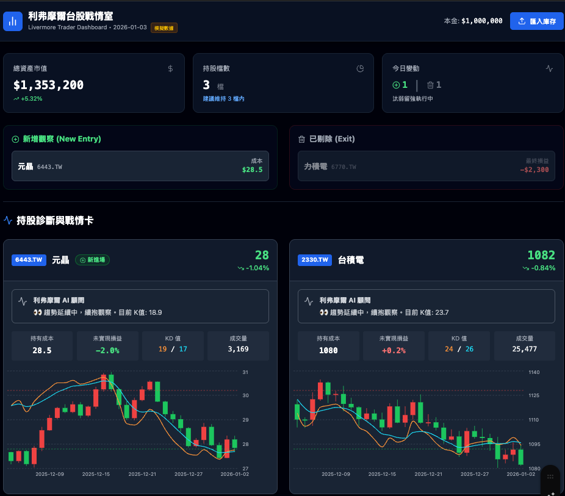

# 利弗摩爾台股戰情室 (Livermore Trader Dashboard)

🎯 基於 Jesse Livermore 交易哲學設計的台股觀察清單與分析工具



## ✨ 功能特色

- **異動偵測** - 自動比對今日 vs 昨日持股
  - 🟢 新加入的股票（綠色標籤 + NEW）
  - 🔘 被去除的股票（灰色刪除線）
- **AI 盤勢解讀** - 整合 Google Gemini 生成每日市場分析
  - 📝 **每日文章**：自動生成市場回顧與技術分析摘要
  - 🌊 **瀑布流瀏覽**：專屬文章列表頁面，快速回顧歷史盤勢
- **K線圖表** - 每檔股票提供：
  - 近 1 個月 K 線圖（紅漲綠跌）
  - KD 指標疊加 (9,3,3 參數)
  - 超買/超賣參考線
- **技術篩選** - 基於利弗摩爾規則掃描：
  - 觸發 10% 支撐風險提醒 (客觀幅度計算)
  - 帳面獲利 20% 趨勢標示
  - KD 技術指標訊號偵測
  - 量能與均線狀態掃描

## 🚀 快速開始

### 1. 安裝依賴
```bash
# 前端
cd frontend
npm install

# 後端 (Python API)
pip install flask flask-cors yfinance pandas numpy
```

### 2. 啟動開發環境
請開啟 **兩個** 終端機視窗分別執行：

**Terminal 1 (前端 React):**
```bash
cd frontend
npm run dev
```

**Terminal 2 (後端 Python server):**
```bash
# 在專案根目錄執行
python backend/server.py
```

前端會自動透過 Proxy 連線至後端，無需安裝 Vercel CLI。

瀏覽器開啟：**http://localhost:5174**

## 🤖 GitHub Actions 自動更新

專案包含每日自動更新腳本，會在台灣時間每天 18:00 (收盤後) 執行：

### 手動執行
```bash
python scripts/update_daily.py
```

### 自動排程
- 已設定 GitHub Actions workflow
- 每個交易日 (週一至週五) 自動執行
- 更新結果存放於 `frontend/public/data/daily_scan_results.json`

## 📖 使用方式

1. **匯入庫存** - 點擊右上角「匯入庫存」按鈕
2. **搜尋股票** - 輸入代碼或名稱（如 2330 或 台積電）
3. **設定成本** - 輸入您的平均成本與股數
4. **確認匯入** - 系統自動分析並顯示K線與策略訊號

## 🏗️ 技術架構

```
TrendGuard/
├── frontend/                 # React 前端
│   ├── src/
│   │   ├── App.jsx          # 主應用元件
│   │   └── index.css        # TailwindCSS
│   └── public/data/         # 每日更新資料
├── scripts/
│   └── update_daily.py      # 每日更新腳本
├── .github/workflows/
│   └── daily-update.yml     # GitHub Actions
└── README.md
```

## ⚠️ 免責聲明

本系統使用模擬數據，僅供參考，不構成投資建議。投資有風險，請謹慎評估。

## 📄 License

MIT
